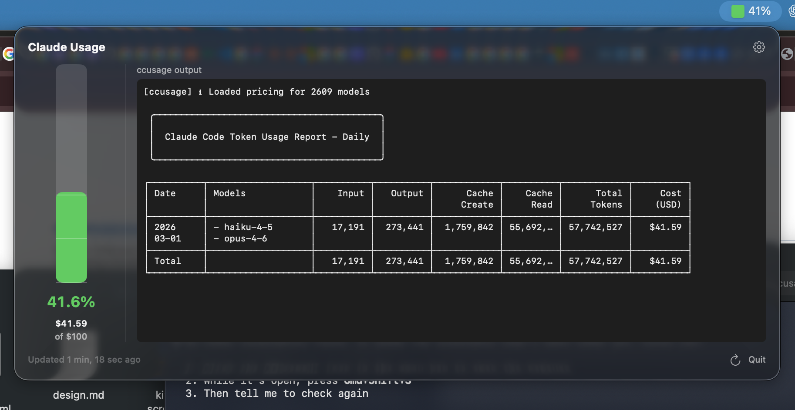

# CCUsageUI

A native macOS menu bar app for monitoring [Claude Code](https://claude.ai/claude-code) usage via [ccusage](https://github.com/ryoppippi/ccusage).

## Features

- **Menu bar icon** with colored square and percentage indicator reflecting current spend
- **Color-coded usage bar** — green, yellow, red, black at configurable thresholds (default 50%, 70%, 90%, 100%)
- **Two-column popover** — usage bar + stats on the left, full `ccusage` output on the right
- **Auto-refresh** every 5 minutes (configurable)
- **Settings screen** to configure daily budget, color thresholds, and refresh interval

## Requirements

- macOS 14.0+
- [ccusage](https://github.com/ryoppippi/ccusage) installed and available in PATH
- Xcode 16+

## Build & Run

1. Open `CCUsageUI.xcodeproj` in Xcode
2. Press Cmd+R to build and run
3. The app appears as a menu bar icon (no dock icon)

## Configuration

Click the gear icon in the popover to open Settings:

- **Daily Budget** — your daily spend limit in USD (default $100)
- **Color Thresholds** — customize when the bar changes from green to yellow to red to black
- **Refresh Interval** — how often ccusage is queried (default 5 minutes)
